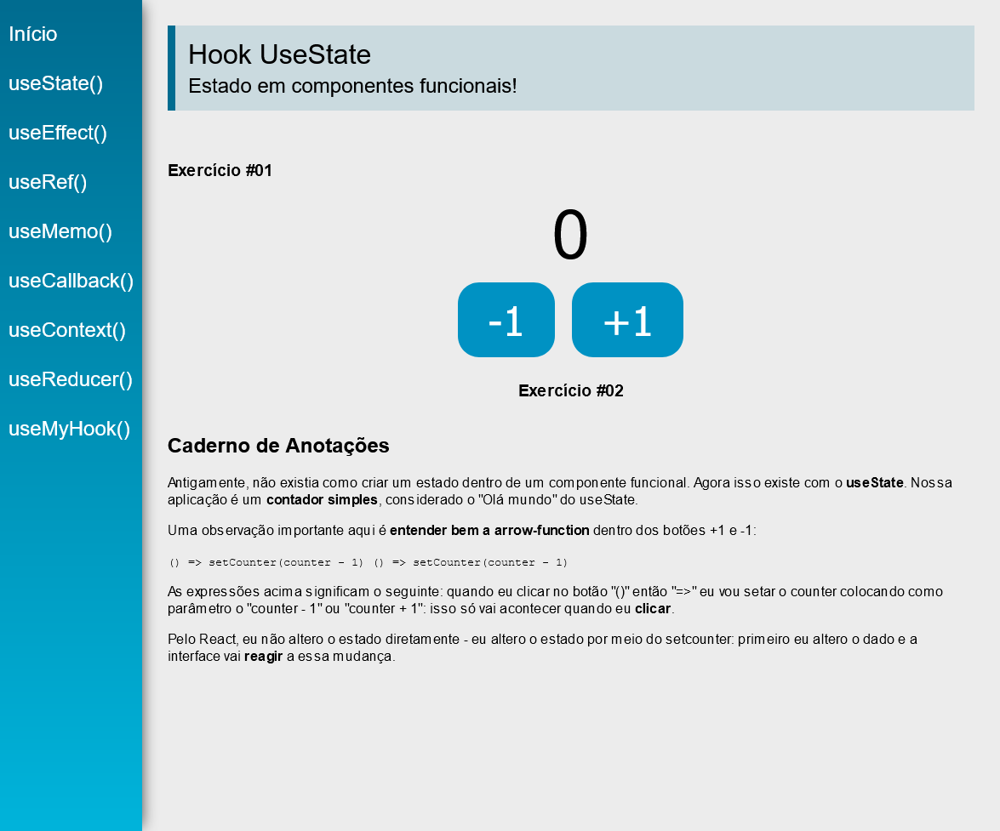

_This README.md file is in English and Portuguese. // Esse arquivo README.md está em Inglês e Português._

# Em construção

## React.js - Aplicação com React Hooks

###  _Aplicação simples para aprender e praticar **React Hooks**._


 ⚠️ _Esta aplicação está sendo criada enquanto eu sigo o projeto "Hooks" do curso de React e Redux do Leonardo Moura Leitão. O curso está [disponível na Udemy aqui](https://www.udemy.com/course/react-redux-pt/). Essa aplicação inicia-se com uma pasta SRC com conteúdos iniciais. A partir dela, novas criações. Esse é o início._  ⚠️

  _Printscreen da versão atual (em construção) abaixo._



 **CONTEÚDOS**

 1. useState #01 - OK
 2. useState #02 - OK
 3. useEffect - OK
 4. Desafio useEffect - OK
 5. useRef #01 - OK
 6. useRef #02 - OK
 7. Desafio função Merge - OK
 8. useMemo - OK
 9. useCallback - OK
 10. Context API
 11. useContext #01
 12. useContext #02
 13. useReducer #01
 14. Desafio useReducer
 15. useReducer #02
 16. Custom Hooks #01
 17. Custom Hooks #02

## Caderno de Anotações

### No Powershell

```
cd  pasta-onde-vai-ser-criado-projeto
npx create-react-app 'nome-do-app'
npm i react-router-dom@5.2.0
npm start
```
[ANOTAÇÕES.md](https://github.com/barbaracalderon/react-hooks/blob/master/ANOTA%C3%87%C3%95ES.md)

_Vem mais coisa. Carregando..._
